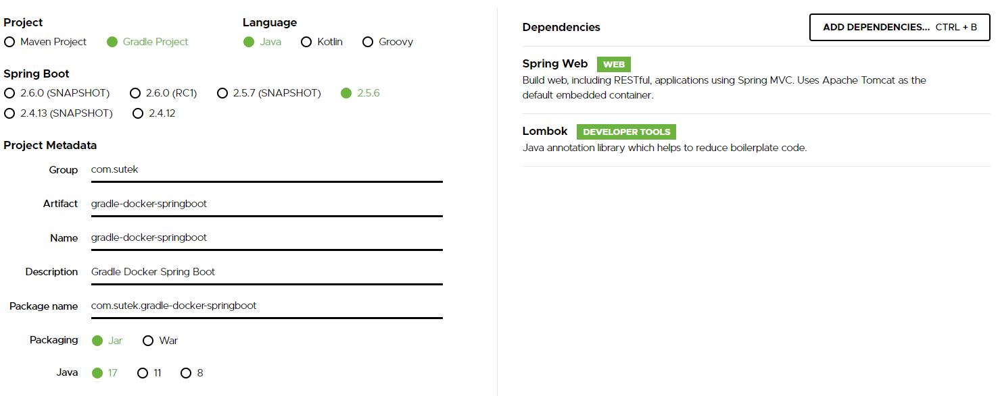
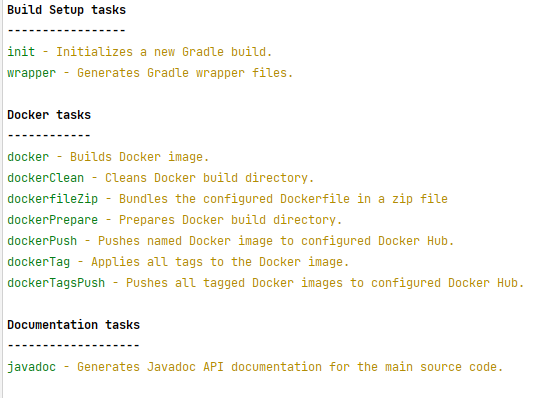
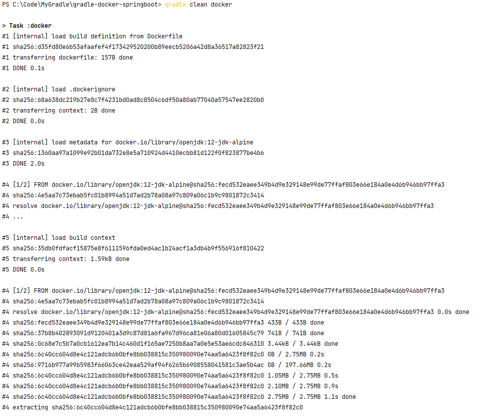
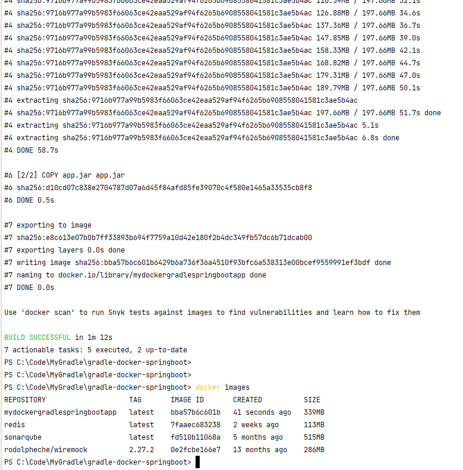
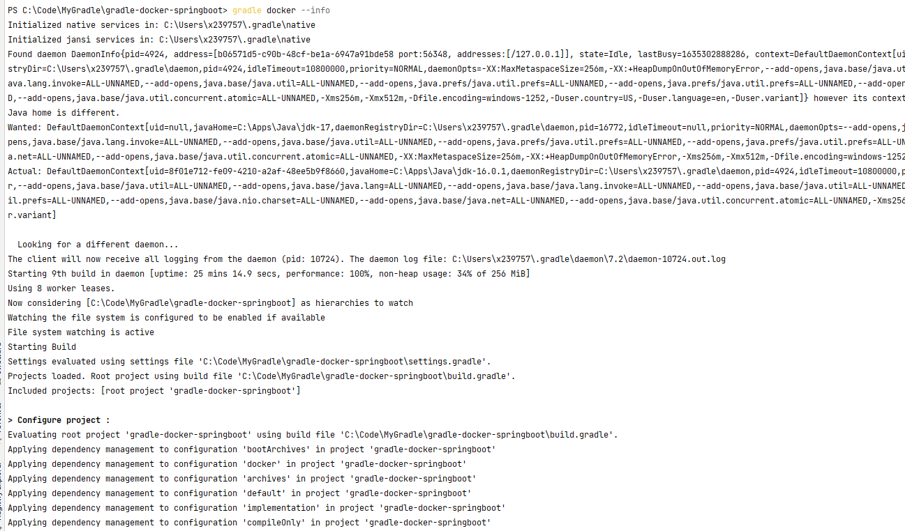
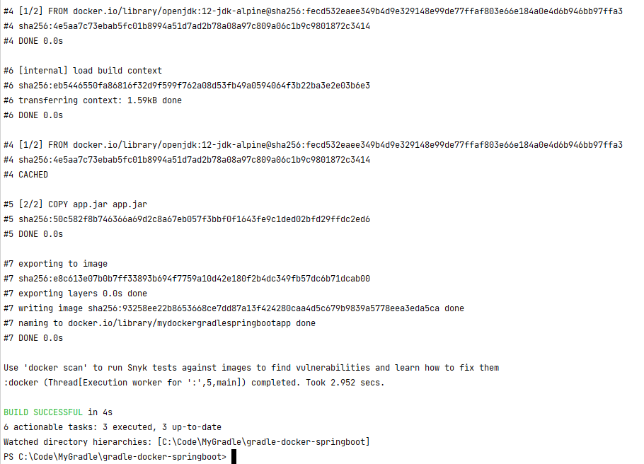
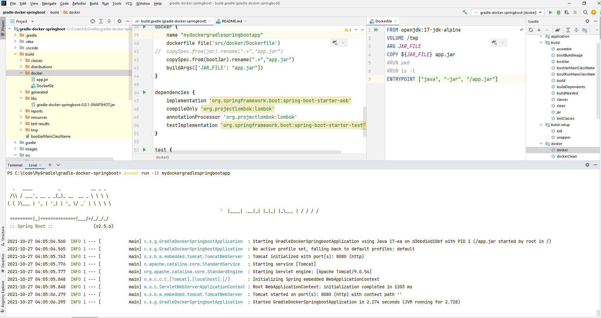

# Gradle Docker Spring Boot

## Set up

Docker Gradle Plugin
https://github.com/palantir/gradle-docker

## Knowledge Points

```
gradle build
gradle tasks
gradle clean build docker
gradle docker --info
```

```
docker images
docker run -it mydockergradlespringbootapp
```

```
copySpec
jar
bootJar
```

```
Watch the proxy settings in <Home>\.gradle\gradle.properties
```

## Screenshot














